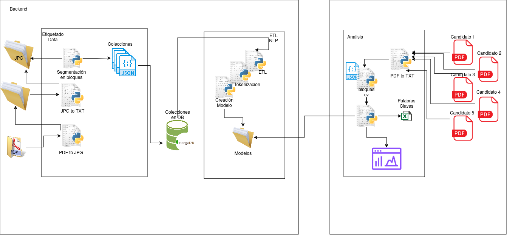
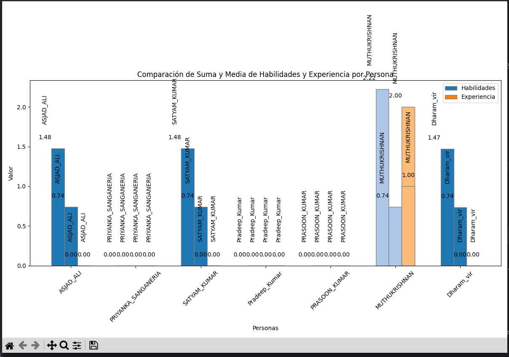
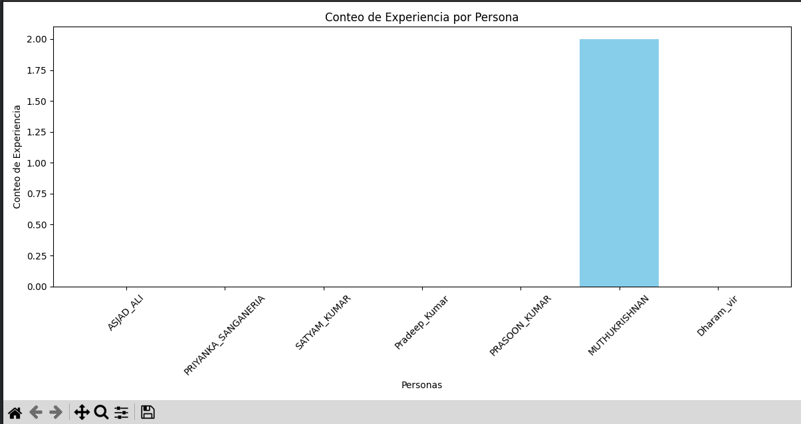
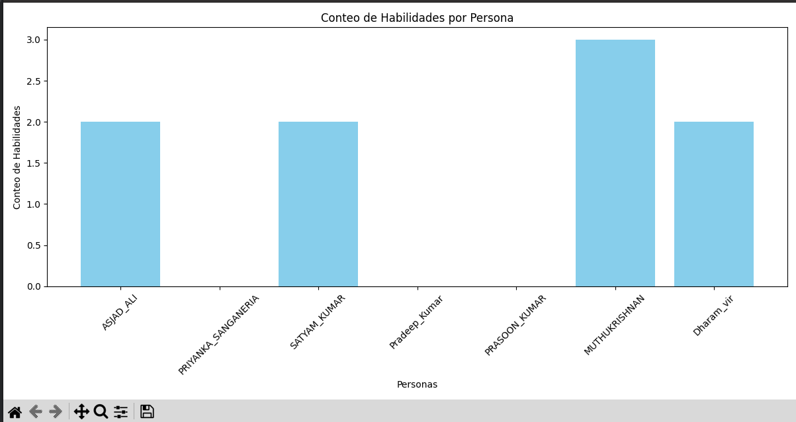
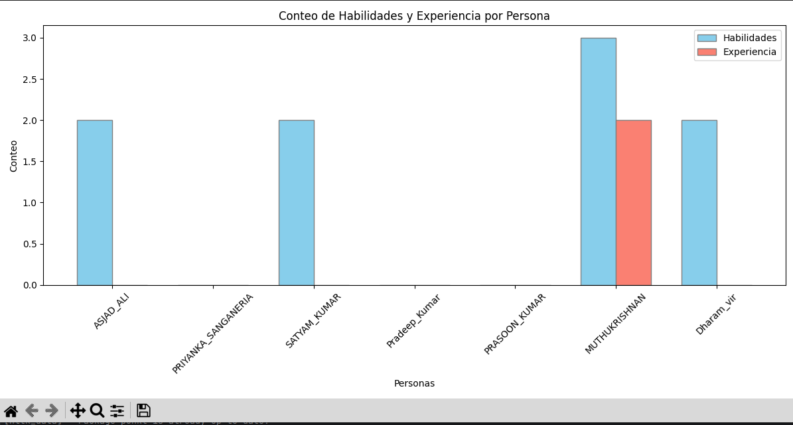

# Recursos-Humanos-Reclutamiento-po
r-medio-de-cv-u sando-NLP
Recursos Humanos y reclutamiento son áreas fundamentales en una organización, y el proceso de selección de candidatos es crucial para encontrar el talento adecuado. En la era digital, el uso de tecnologías avanzadas se ha vuelto cada vez más común para agilizar y mejorar este proceso

## Arquitectura
El reclutamiento predictivo utiliza el Procesamiento del Lenguaje Natural (NLP) y Word2Vec para mejorar el proceso de contratación. Mediante el análisis de currículums y perfiles, el NLP extrae información relevante, mientras que Word2Vec representa palabras como vectores numéricos. Esta combinación permite encontrar candidatos adecuados para las necesidades de la empresa.

## Resultados

    Suma de Habilidades: Se observa una variabilidad en los niveles de habilidades entre las personas representadas. Algunos individuos muestran una suma de habilidades alta, indicando un fuerte conocimiento en las áreas específicas, mientras que otros no presentan datos, lo que puede reflejar falta de información o menor nivel de habilidades.
    Media de Habilidades: La media de habilidades proporciona una perspectiva adicional sobre la consistencia en el nivel de habilidades de cada persona. Se observa que algunos individuos mantienen una media consistente con su suma de habilidades, lo que sugiere estabilidad en su nivel de competencia.

    La variabilidad en los niveles de experiencia refleja diferencias marcadas en la cantidad y profundidad de conocimientos adquiridos por cada persona.
    Algunos individuos presentan una experiencia considerable, tanto en términos de suma como de media, lo que sugiere una trayectoria sólida y consolidada en el campo de especialización.
    Por el contrario, se identifican casos en los que la experiencia es limitada o no está claramente definida, señalando áreas donde se podría mejorar la adquisición de conocimientos y habilidades.

    Se evidencia una amplia variabilidad en los niveles de habilidades entre las personas representadas en el gráfico.
    Algunos individuos muestran altas sumas y medias de habilidades, lo que sugiere un dominio sólido en las áreas específicas analizadas.
    Por otro lado, se observan casos de personas con niveles más bajos de habilidades, indicando la existencia de diferencias significativas en la competencia entre los individuos.

    Se observa una variabilidad significativa en los niveles de habilidades y experiencia entre las personas representadas.
    Algunos individuos muestran altas sumas y medias tanto en habilidades como en experiencia, lo que sugiere un nivel avanzado en ambas áreas.
    Otros individuos presentan niveles más bajos en habilidades y experiencia, indicando una posible necesidad de desarrollo y mejora en estos aspectos.

